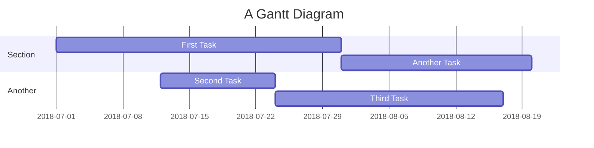

# Backend para o projeto chamada inteligente da UFF
Backend da aplicação de chamada para a disciplina de Engenharia de Software II 2023.2 da UFF

## Useful Links:
* [Using Environment Variable in Spring Boot application.properties](https://www.baeldung.com/spring-boot-properties-env-variables#:~:text=To%20use%20this%20variable%20in%20Spring%20Boot%E2%80%99s%20application.properties%2C%20we%20need%20to%20surround%20it%20with%20braces%3A)
* [Github Cheat Sheet](https://education.github.com/git-cheat-sheet-education.pdf)
* [Markdown Cheat Sheet](https://www.markdownguide.org/cheat-sheet/)
* [Mermaid Cheat Sheet](https://jojozhuang.github.io/tutorial/mermaid-cheat-sheet/) (Markdown Diagrams)

## TODO:
- [x] Criar base sql e entity user para teste
- [ ] Criar verificações adicionais no service
- [ ] Ao receber um user de volta, o enum UserType volta como null, consertar isso
- [ ] Usar sequences

## App Flow:


## Gantt Diagram:


## SQL Query to Create Schema and Tables:
```SQL
DROP SCHEMA IF EXISTS chamada_uff ;
CREATE SCHEMA IF NOT EXISTS chamada_uff DEFAULT CHARACTER SET utf8;
USE chamada_uff ;

CREATE TABLE IF NOT EXISTS `user` (
	`id` INT NOT NULL,
    `username` VARCHAR(20) NOT NULL,
    `password` VARCHAR(50) NOT NULL,
    `token` VARCHAR(255),
    `type` ENUM('STUDENT', 'PROFESSOR') NOT NULL,
    `name` VARCHAR(255) NOT NULL,
    `email` VARCHAR(255) NOT NULL,
    PRIMARY KEY(id)
);

CREATE TABLE IF NOT EXISTS `semester` (
	`id` INT NOT NULL,
    `year` VARCHAR(4) NOT NULL,
    `semester` INT NOT NULL,
    PRIMARY KEY(id)
);

CREATE TABLE IF NOT EXISTS `class` (
	`id` INT NOT NULL,
    `name` VARCHAR(20) NOT NULL,
    `professor_id` INT NOT NULL,
    `semester_id` INT NOT NULL,
    PRIMARY KEY(id),
    FOREIGN KEY (`professor_id`) REFERENCES `user`(`id`),
    FOREIGN KEY (`semester_id`) REFERENCES `semester`(`id`)
);

CREATE TABLE IF NOT EXISTS `attendance` (
	`id` INT NOT NULL,
    `class_id` INT NOT NULL,
    `start` DATETIME NOT NULL,
    `duration` TIME,
    `status` ENUM('WAITING', 'ACTIVE', 'OVER') NOT NULL,
    PRIMARY KEY(id),
    FOREIGN KEY (`class_id`) REFERENCES `class`(`id`)
);

CREATE TABLE IF NOT EXISTS `response` (
	`id` INT NOT NULL,
    `student_id` INT NOT NULL,
    `attendance_id` INT NOT NULL,
    `start` DATETIME NOT NULL,
    `end` DATETIME,
    PRIMARY KEY(id),
    FOREIGN KEY (`student_id`) REFERENCES `user`(`id`),
    FOREIGN KEY (`attendance_id`) REFERENCES `attendance`(`id`)
);

CREATE TABLE IF NOT EXISTS `justification` (
	`id` INT NOT NULL,
    `student_id` INT NOT NULL,
    `attendance_id` INT NOT NULL,
    `created_at` DATETIME NOT NULL,
    `document` MEDIUMBLOB,
    `comment` VARCHAR(500),
    PRIMARY KEY(id),
    FOREIGN KEY (`student_id`) REFERENCES `user`(`id`),
    FOREIGN KEY (`attendance_id`) REFERENCES `attendance`(`id`)
);
```

## SQL Query to Populate Tables:
```SQL
INSERT INTO `user` (id, username, password, token, type, name, email) VALUES
  (1, 'student1', 'senha1', 'token1', 'STUDENT', 'João Estudante', 'joao@email.com'),
  (2, 'professor1', 'senha2', 'token2', 'PROFESSOR', 'Prof. Silva', 'silva@email.com'),
  (3, 'student2', 'senha3', 'token3', 'STUDENT', 'Maria Aluna', 'maria@email.com');

INSERT INTO `semester` (id, year, semester) VALUES
  (1, '2023', 1),
  (2, '2023', 2),
  (3, '2024', 1);

INSERT INTO `class` (id, name, professor_id, semester_id) VALUES
  (1, 'Matemática 101', 2, 1),
  (2, 'Física 201', 2, 2),
  (3, 'História 101', 2, 3);

INSERT INTO `attendance` (id, class_id, start, duration, status) VALUES
  (1, 1, NOW(), '02:00:00', 'ACTIVE'),
  (2, 2, NOW(), '01:30:00', 'WAITING'),
  (3, 3, NOW(), '01:45:00', 'OVER');

INSERT INTO `response` (id, student_id, attendance_id, start, end) VALUES
  (1, 1, 1, NOW(), NOW()),
  (2, 3, 1, NOW(), NOW()),
  (3, 2, 2, NOW(), NOW());

INSERT INTO `justification` (id, student_id, attendance_id, created_at, document, comment) VALUES
  (1, 1, 1, NOW(), NULL, 'Motivo da justificação 1'),
  (2, 2, 2, NOW(), NULL, 'Motivo da justificação 2'),
  (3, 3, 3, NOW(), NULL, 'Motivo da justificação 3');
```